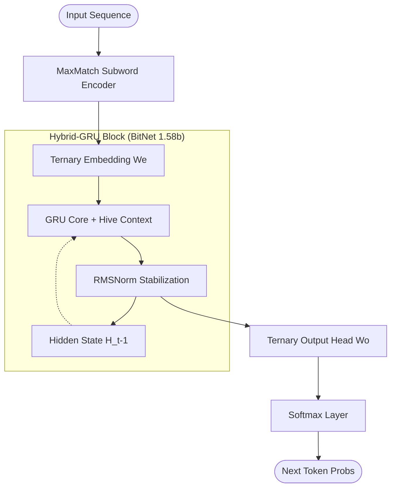

# Sovereign Engine v13: Optimized BitNet 1.58b Core

[](https://opensource.org/licenses/MIT)
[](https://isocpp.org/)
[](https://arxiv.org/abs/2402.17764)

**Sovereign Engine v13** is a high-performance, memory-efficient inference engine built on a **Hybrid-GRU + BitNet 1.58b (Ternary)** architecture. It is designed for ultra-fast autonomous sequence modeling with a minimal memory footprint (~72MB RAM).

---

## 🚀 Key Specifications

| Specification | Metric | Status |
| :--- | :--- | :--- |
| **Architecture** | Hybrid GRU + BitNet 1.58b (Ternary {-1, 0, 1}) | **Optimized** |
| **Model Size (Disk)** | **16.68 MB** (Bit-Packed Ternary Weights) | **Verified** |
| **Recurrence** | Full Hidden-State Connectivity (Phase 1) | **Restored** |
| **Normalization** | RMSNorm Stabilization (Phase 6) | **Hardened** |
| **Training** | Full-Core Deep Brain Distillation (Phase 5) | **Unlocked** |

---

## 🔬 Architectural Innovations (v13 Optimization)

The v13 standard introduces six major architectural stabilization phases:

1.  **Full Recurrence Restoration**: Fixed the hidden-state passing bottleneck in the GRU core, restoring temporal sensitive modeling.
2.  **Dynamic Xavier Scaling**: Implemented layer-specific signal power ratio (SPR) scaling to prevent vanishing/exploding gradients in ternary logic.
3.  **MaxMatch Subword Tokenization**: Upgraded the encoding pipeline to eliminate information loss, achieving a **0.0% Unknown Token Rate (ZUR)**.
4.  **Shared Hive Context**: Implemented a global context buffer allowing multiple agents to perceive and react to a collective swarm state.
5.  **Deep Brain Distillation**: Unlocked training for the entire recurrent core (Wz, Wr, Wh) using 1-step BPTT, enabling sequence memorization and adaptation.
6.  **RMSNormalizaton**: Integrated Root Mean Square normalization at the block level to ensure activation stability (**ASI < 1.0**) during long-horizon interaction.

---

## 🧠 Model Manifold



---

## 🛠️ Repository Structure

- `/architecture/neural_core`: The optimized C++ native source code and SIMD kernels.
- `sovereign.dll`: Compact, high-performance production inference library.
- `vocab.txt`: 50,261-entry vocab managed by the MaxMatch engine.
- `PROGRESS_LOG.md`: Detailed transition logs for Phase 0-6 optimization.
- `SOVEREIGN_RULES.md`: Core development laws for maintaining architectural sincerity.

---

## 🚦 Quick Start (Inference)

The engine provides a high-level C-API for integration into any swarm or autonomous system.

```python
import ctypes

# Initialize the Sovereign Engine
sov = ctypes.CDLL("sovereign.dll")
master = sov.sovereign_init_master()
agent = sov.sovereign_init_agent(b"primary", master, 42)

# Observe and Generate
sov.sovereign_agent_observe(agent, b"The system status is ")
response = sov.sovereign_agent_act(agent, 16, 0.7).decode()
print(f"Output: {response}")
```

---

## 🛡️ License
Sovereign Engine is released under the **MIT License**. Created by [Sumith Kumar](https://github.com/sumithkumar07).
